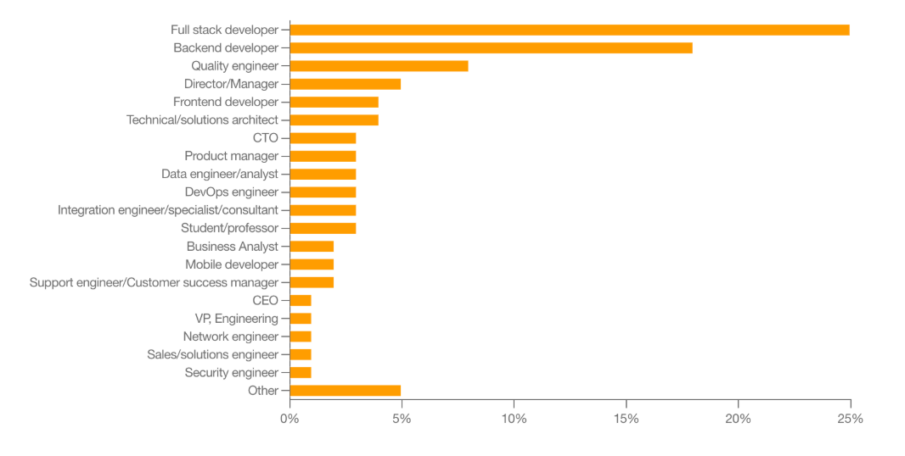
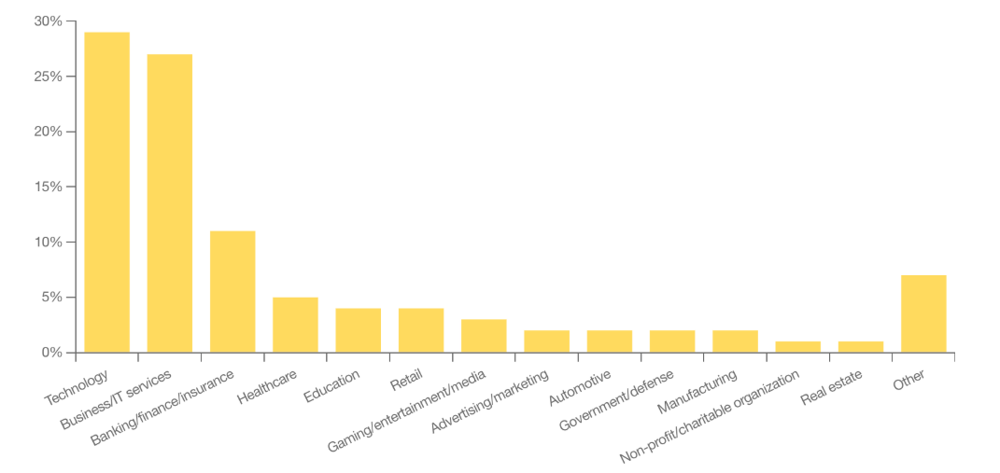
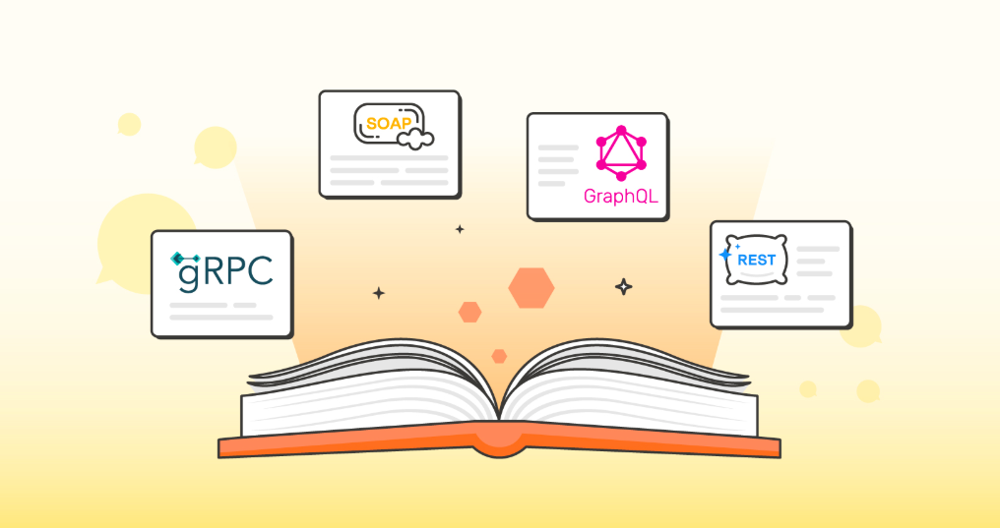
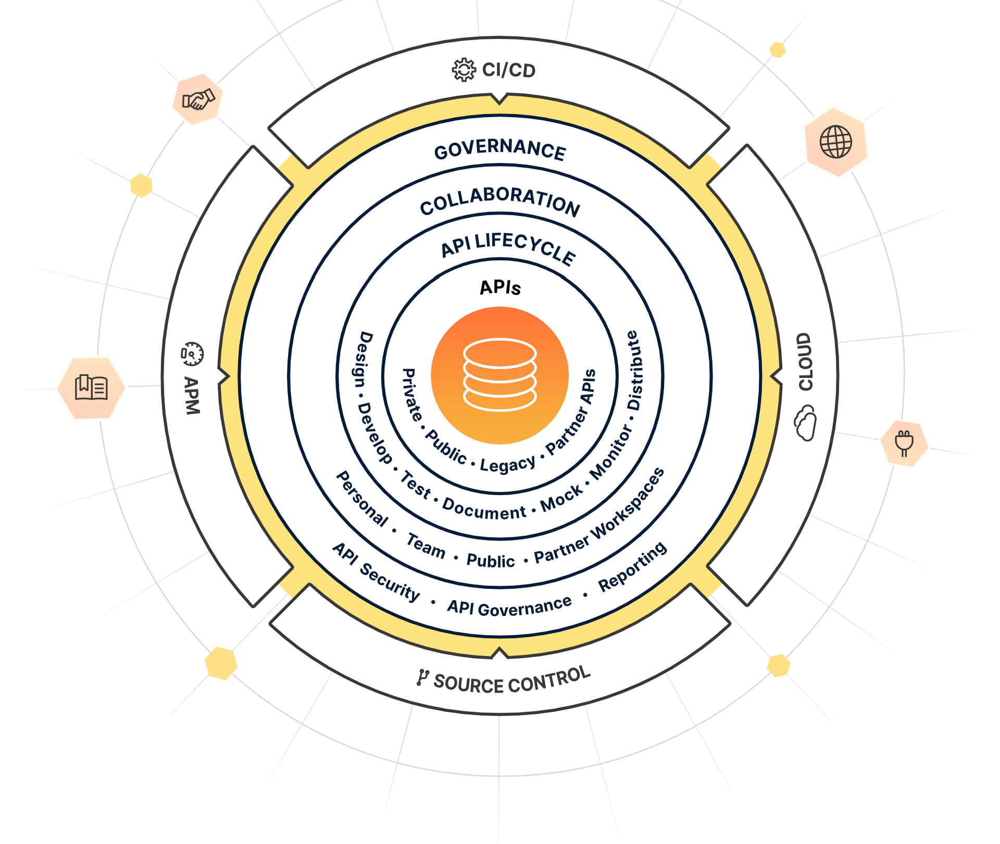
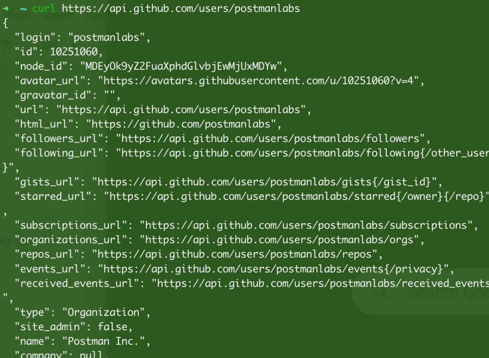
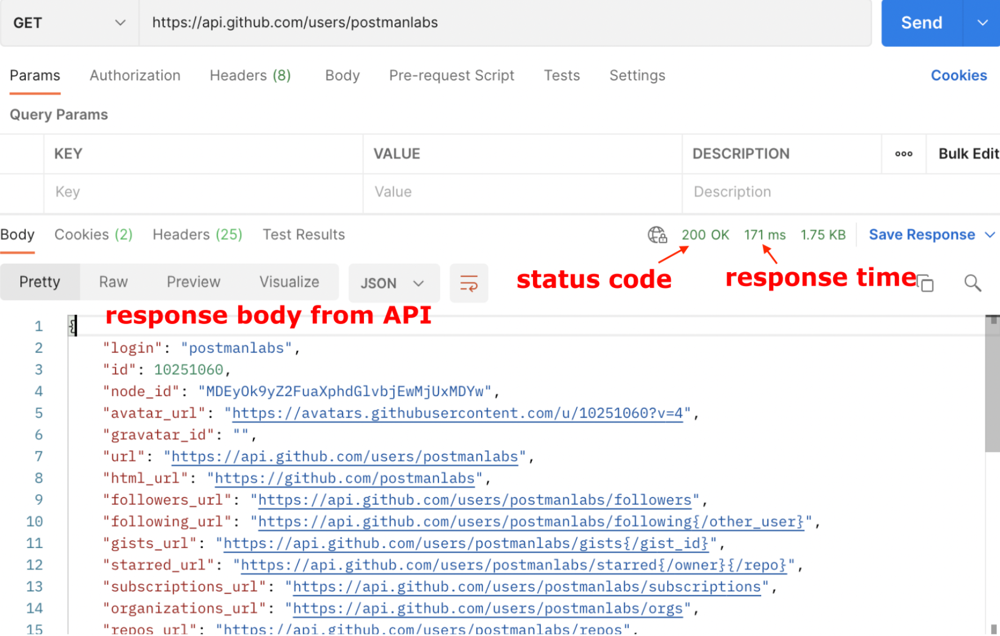
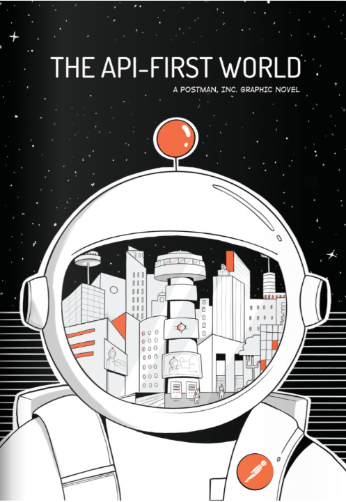
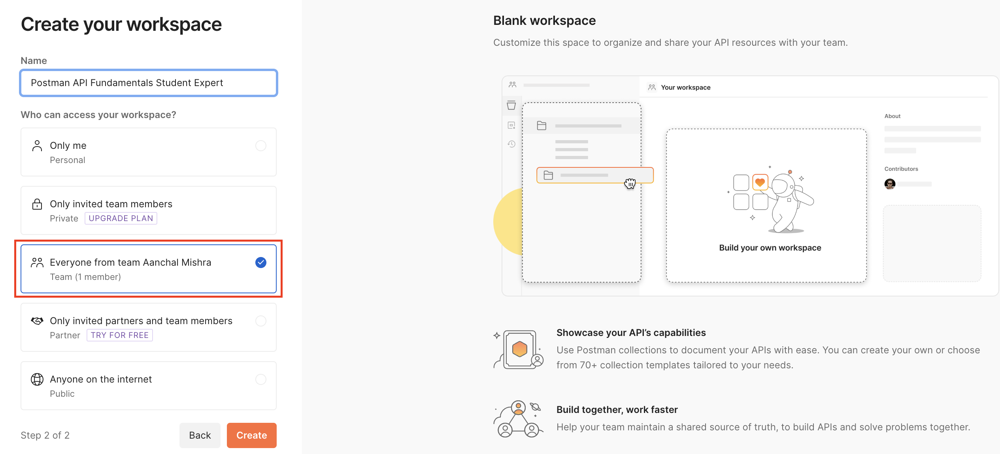

<h1>What are APIs?<h1>

<h1 align="center">Application Programming Interfaces</h1>

An <b>Application Programming Interface (API)</b> is a <u>contract that allows code to talk to other code</u>. APIs are the building blocks of modern software because they allow for sharing of resources and services across applications, organizations, and devices.

 

Have you ever made a payment on a website? Checked the weather on a mobile app? Listened to Spotify on both your desktop and your phone? Used Google Maps inside another app? Whether you know it or not, you are using APIs every day. Even this lesson you are reading is brought to you by an API!

 

<h2>Why are APIs important?</h2>
<ol>
<li>APIs help developers <b>integrate exciting features</b> and <b>build automation</b> without reinventing the wheel

<i>ex: using a Weather API instead of launching your weather balloons</i>
</li>
<li>APIs allow enterprises to <b>open up their product for faster innovation</b>

<i>ex: apps that interact with Twitter or Meta APIs by posting on your behalf or reading tweets</i>
</li>
<li>APIs can <b>be products themselves</b>

<i>ex: Software as a Service (SaaS) products like Stripe's payment APIs or Twilio's text messaging and email APIs</i>
</li>
</ol>

 

<h2>Who works with APIs?</h2>

<b>APIs are not just for developers.</b> According to Postman's latest State of the API Report, almost half of the survey respondents identified as holding non-developer roles, such as management, solutions architects, business and data analysts, educators and researchers. All these roles benefit from the standardized data access provided by APIs.

<b>API use is not limited to the tech and IT industries.</b> Survey responses in the same report show that while tech, business, IT, and banking sectors represent the bulk of API use, any industry can benefit from the convenience provided by APIs. 

 

<h2>Who benefits from APIs?</h2>

Ultimately, <b>everyone benefits from APIs</b> either directly or indirectly because APIs make processes more efficient and connect the services we love and rely on.

  

<h1 align="center">APIs - A Digital Restaurant</h1>

You can think of APIs as being like a waiter at a restaurant, serving as a go-between for the customer and the kitchen. 

A customer who wants soup doesn't go into the kitchen to cook. They don't even have to know how to make soup! They only have to know <i>how to ask the waiter for soup, expecting the waiter to bring back soup</i>.

 

APIs work the same way, but there are different names for the players involved. Instead of soup, the requester might ask for data or execution of a service.  

<table>
<tr>
<th>Networking term</th>
<th>Description</th>
<th>Restaurant analogy</th>
</tr>
<tr>
<td>Client</td>
<td><i>The requester. Ex: browser, web app, mobile app</i></td>
<td>Customer</td>
<tr>
<tr>
<td>API</td>
<td><i>Simplified interface for interacting with the backend</i></td>
<td>Waiter</td>
</tr>
<tr>
<td>Server</td>
<td><i>The backend where the processing happens</i></td>
<td>Kitchen</td>
<tr>
</table>

  

<h1 align="center">Types of APIs</h1>

<h2>Medium</h2>

While this course will focus on Web APIs, it is important to know that "API" can apply to a broad range of interfaces.

<ul>
<li><b>Hardware APIs</b></li>

Interface for software to talk to hardware. <i>Example: How your phone's camera talks to the operating system. </i>

 

<li><b>Software Library APIs</b></li>

Interface for directly consuming code from another code base. <i>Example: Using methods from a library you import into your application.</i>

 
<li><b>Web APIs</b></li>

Interface for communicating across code bases over a network. <i>Example: Fetching current stock prices from a finance API over the internet.</i>

</ul>

Multiple API types may be used to achieve a task. For example, uploading a photo to Instagram makes use of various APIs:

 

<ol>
<li><u>Hardware API</u> for the app to talk to your camera</li> 
<li><u>Software library API</u> for the image to be processed with filters</li> 
<li><u>Web API</u> for sending your image to Instagram's servers so your friends can like it!</li>
</ol> 

<h2>Architectures</h2>

There is more than one way to build and consume APIs. Some architecture types you may come across are:

<ul>
<li>REST (Representational State Transfer)</li>
<li>GraphQL</li>
<li>WebSockets</li>
<li>webhooks</li>
<li>SOAP (Simple Object Access Protocol)</li>
<li>gRPC (Google Remote Procedure Call)</li>
<li>MQTT (MQ Telemetry Transport)</li>
</ul>

<h4>Rest APIs</h4>

Some traits of REST APIs include not storing session state between requests, the ability to cache, and the ability to send and receive various data types. Still confused? Don't worry; we will learn hands-on very soon in this course!

<h2>Access</h2>

APIs also vary in the scope of who can access them.

<ol>
<li><b>Public APIs (aka Open APIs)</b> Consumed by anyone who discovers the API
</li>
<li><b>Private APIs</b> Consumed only within an organization and not made public</li>
<li><b>Partner APIs</b> Consumed between one or more organizations that have an established relationship</li>
</ol>

 

<h1>Introducing Postman</h1>

 

<h1 align="center">An API Platform</h1>

<a href="https://www.postman.com/company/about-postman/" target="_blank">Postman</a> is an API platform for building and using APIs. Postman simplifies each step of the API lifecycle and streamlines collaboration so you can create better APIs faster and consume them with ease. That's why Postman is trusted by over <b>25 million users</b> worldwide!
  

<h2>Working with APIs then and now: cURL vs. Postman</h2>

Before Postman, it was common practice to poke at APIs with a command line tool for making HTTP requests called <a href="https://en.wikipedia.org/wiki/CURL" target="_blank">cURL</a>. This tool is still used today but has its limitations when it comes to collaboration and sharing. 

<b>API calls with <code>curl</code></b>

This is an example of what an API call in the terminal using the <code>curl</code> command looks like. Here we are fetching data about <a href="https://github.com/" target="_blank">GitHub</a> user <a href="https://github.com/postmanlabs" target="_blank">postmanlabs</a>
 

<code>curl https://api.github.com/users/postmanlabs</code>

 

It works great, but once you make the call, the API response data is lost in the river of the terminal. You also don't have visibility of the metadata of the response without adding more details to the command.
 

<b>API calls with Postman</b>

Here is the same call done with Postman. Postman shows the response with clean indents and colors and allows you to save, organize and share your requests. You can also see all the components of the request and response broken down into tabs and other helpful details like the response time and status code. 
 

 

<h1 align="center">The API First World</h1>

Postman has a <a href="https://blog.postman.com/celebrating-20-million-postman-users/" target="_blank">vision for an API First World</a> - one where 100 million developers are connected through APIs, and APIs take center stage as primary building blocks. In the API-first world:
 

<ul>
<li><b>APIs are considered a #1 priority</b></li>
<li><b>APIs are easily consumable</b></li>
<li><b>APIs are easily discoverable</b></li>

</ul>

<h3><a href="https://api-first-world.com/" target="_blank">The API-First World </a></h3>

  

<h1>Your First API Request</h1>

 

<h1 align="center">Task: Create a workspace</h1>

Are you ready to become a digital librarian using the <b>Postman Library API v2?</b>

This REST API allows you to <a href="https://en.wikipedia.org/wiki/Create,_read,_update_and_delete" target="_blank">CRUD</a> (<b>C</b>reate, <b>R</b>ead, <b>U</b>pdate, <b>D</b>elete) books in a public library database. You will use Postman to interact with this API and manage books.

<h2>Open Postman for web</h2>

Postman can be Used as a desktop app or web browser. This course will show you how to use It in the browser. 

<ol>
<li>Navigate to <a href="https://www.postman.com/" target="_blank">https://www.postman.com/</a></li> 
<li>Sign in if you have an account, or <a href="https://identity.getpostman.com/signup?authFlowId=13a2b251-452f-42b8-8aec-893e6c8cdaf6" target="_blank">sign</a> up for free! </li>
</ol>

<h2>Create a Workspace</h2>

To start making Postman requests, you need to be inside a workspace. Let's make one! 
 

1. <b>Workspaces</b> dropdown > <b>Create Workspace</b>
 

 

2. Select Blank Workspace as Template and Name your workspace "<b>Postman API Fundamentals Student Expert</b>"
 

 

><b>Info:</b> While working with your personal APIs, you can choose from a template listed, which can set you up with some pre-defined structure or use a blank workspace. For our course we will use a blank workspace. 

3. Set the visibility to <b>Everyone from team</b>. Then click "<b>Create Workspace.</b>"
 

 

<h3>Success!</h3>

Welcome to your empty new workspace.
                                                                

<h1 align="center">Task: Create a Collection</h1>

<a href="" target="_blank">Collections</a> are places to organize your API requests in Postman. They serve as executable documentation of API endpoints. 

 

Let's create a new Collection in our workspace to keep our requests to the <b>Postman Library API v2.</b>
 

1. From the left pane, either click the plus ("+") icon or Create a collection. 
 

 

2. Select Blank collection
 

 

3. Name your new Collection “<b>Postman Library API v2</b>”
 

 

>Let's Go🚀!

 

<h1 align="center">Task: Get books from the Library API</h1>

First things first: a librarian must know how to view all the books in the library catalog.

According to the API documentation, you can get all the books in the library by making a request to <code>GET https://library-api.postmanlabs.com/books.</code> Here, <code>GET</code> is the <b>request method,</b> and the <b>request URL</b> indicates where the request is sent. We'll cover what that means soon - but first, let's get our hands dirty with our first request!
 

<h2>Make your first request.</h2>

1. Create a new request by either clicking <b> Add a request</b> inside your new Collection or hovering on your Collection, then click the three dots icon and "Add request" 
 
 

2. Name your request "<b>get books</b>". Set the request method to <b>GET</b>, and the <b>request URL</b> to GET <code>https://library-api.postmanlabs.com/books</code>
 

3. Send your request by clicking the Send button

<h2>View the response</h2>

If everything goes well, you will see a response from the server in the lower half of Postman.

It should look like this: a JSON (JavaScript Object Notation) response body with an <b>array</b> of book <b>objects</b>. You can scroll down to see more books.

 

You might see different books because this public library is being modified in real-time by other Postman librarians worldwide!

<h2>Request methods</h2>

When we make an HTTP call to a server, we specify a request method that indicates the type of operation we are about to perform. These are also called HTTP verbs.

Some common HTTP request methods correspond to the CRUD operations mentioned earlier. You can see a list of more methods here.
 

<table>
<tr>
<th>Method Name</th>
<th>Operation</th>

</tr>
<tr>
<td><code>GET</code></td>
<td>Retrieve data (Read)</td>

<tr>
<tr>
<td><code>POST</code></td>
<td>Send data (Create)</td>

</tr>
<tr>
<td><code>PUT/PATCH</code></td>
<td>Update data (Update)

* <code>PUT</code> usually replaces an entire resource, whereas <code>PATCH</code> usually is for partial updates

</td>

<tr>

<tr>
<td><code>DELETE</code></td>
<td>Delete data (Delete)</td>
</table>

