

<h1>What are APIs?<h1>

<h1 align="center">Application Programming Interfaces</h1>

An <b>Application Programming Interface (API)</b> is a <u>contract that allows code to talk to other code</u>. APIs are the building blocks of modern software because they allow for sharing of resources and services across applications, organizations, and devices.

 

Have you ever made a payment on a website? Checked the weather on a mobile app? Listened to Spotify on both your desktop and your phone? Used Google Maps inside another app? Whether you know it or not, you are using APIs every day. Even this lesson you are reading is brought to you by an API!

 

<h2>Why are APIs important?</h2>
<ol>
<li>APIs help developers <b>integrate exciting features</b> and <b>build automation</b> without reinventing the wheel

<i>ex: using a Weather API instead of launching your weather balloons</i>
</li>
<li>APIs allow enterprises to <b>open up their product for faster innovation</b>

<i>ex: apps that interact with Twitter or Meta APIs by posting on your behalf or reading tweets</i>
</li>
<li>APIs can <b>be products themselves</b>

<i>ex: Software as a Service (SaaS) products like Stripe's payment APIs or Twilio's text messaging and email APIs</i>
</li>
</ol>

 

<h2>Who works with APIs?</h2>

<b>APIs are not just for developers.</b> According to Postman's latest State of the API Report, almost half of the survey respondents identified as holding non-developer roles, such as management, solutions architects, business and data analysts, educators and researchers. All these roles benefit from the standardized data access provided by APIs.

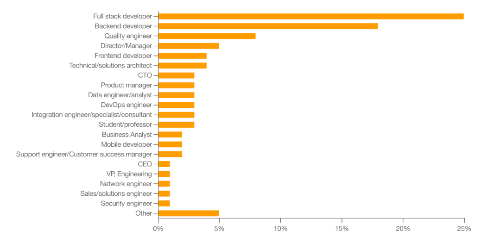

<b>API use is not limited to the tech and IT industries.</b> Survey responses in the same report show that while tech, business, IT, and banking sectors represent the bulk of API use, any industry can benefit from the convenience provided by APIs. 

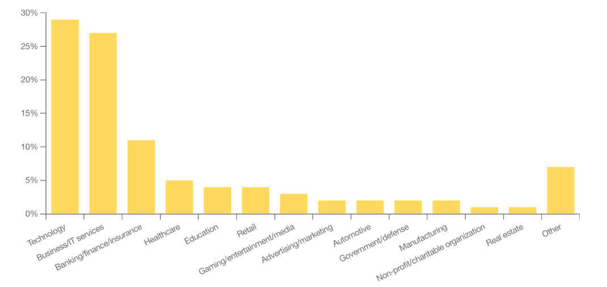

 

<h2>Who benefits from APIs?</h2>

Ultimately, <b>everyone benefits from APIs</b> either directly or indirectly because APIs make processes more efficient and connect the services we love and rely on.

  

<h1 align="center">APIs - A Digital Restaurant</h1>

You can think of APIs as being like a waiter at a restaurant, serving as a go-between for the customer and the kitchen. 

A customer who wants soup doesn't go into the kitchen to cook. They don't even have to know how to make soup! They only have to know <i>how to ask the waiter for soup, expecting the waiter to bring back soup</i>.

 

APIs work the same way, but there are different names for the players involved. Instead of soup, the requester might ask for data or execution of a service.  

<table>
<tr>
<th>Networking term</th>
<th>Description</th>
<th>Restaurant analogy</th>
</tr>
<tr>
<td>Client</td>
<td><i>The requester. Ex: browser, web app, mobile app</i></td>
<td>Customer</td>
<tr>
<tr>
<td>API</td>
<td><i>Simplified interface for interacting with the backend</i></td>
<td>Waiter</td>
</tr>
<tr>
<td>Server</td>
<td><i>The backend where the processing happens</i></td>
<td>Kitchen</td>
<tr>
</table>

  

<h1 align="center">Types of APIs</h1>

<h2>Medium</h2>

While this course will focus on Web APIs, it is important to know that "API" can apply to a broad range of interfaces.

<ul>
<li><b>Hardware APIs</b></li>

Interface for software to talk to hardware. <i>Example: How your phone's camera talks to the operating system. </i>

 

<li><b>Software Library APIs</b></li>

Interface for directly consuming code from another code base. <i>Example: Using methods from a library you import into your application.</i>

 
<li><b>Web APIs</b></li>

Interface for communicating across code bases over a network. <i>Example: Fetching current stock prices from a finance API over the internet.</i>

</ul>

Multiple API types may be used to achieve a task. For example, uploading a photo to Instagram makes use of various APIs:

 

<ol>
<li><u>Hardware API</u> for the app to talk to your camera</li> 
<li><u>Software library API</u> for the image to be processed with filters</li> 
<li><u>Web API</u> for sending your image to Instagram's servers so your friends can like it!</li>
</ol> 

<h2>Architectures</h2>

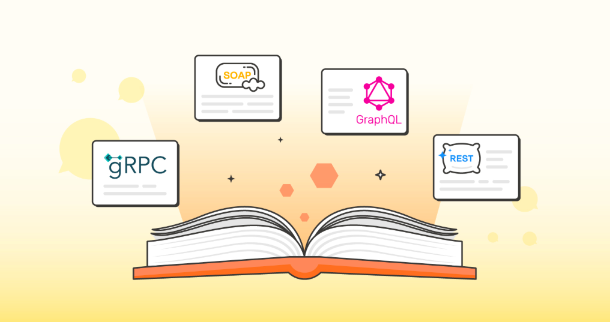

There is more than one way to build and consume APIs. Some architecture types you may come across are:

<ul>
<li>REST (Representational State Transfer)</li>
<li>GraphQL</li>
<li>WebSockets</li>
<li>webhooks</li>
<li>SOAP (Simple Object Access Protocol)</li>
<li>gRPC (Google Remote Procedure Call)</li>
<li>MQTT (MQ Telemetry Transport)</li>
</ul>

<h4>Rest APIs</h4>

Some traits of REST APIs include not storing session state between requests, the ability to cache, and the ability to send and receive various data types. Still confused? Don't worry; we will learn hands-on very soon in this course!

<h2>Access</h2>

APIs also vary in the scope of who can access them.

<ol>
<li><b>Public APIs (aka Open APIs)</b> Consumed by anyone who discovers the API
</li>
<li><b>Private APIs</b> Consumed only within an organization and not made public</li>
<li><b>Partner APIs</b> Consumed between one or more organizations that have an established relationship</li>
</ol>

 

<h1>Introducing Postman</h1>

 

<h1 align="center">An API Platform</h1>

<a href="https://www.postman.com/company/about-postman/" target="_blank">Postman</a> is an API platform for building and using APIs. Postman simplifies each step of the API lifecycle and streamlines collaboration so you can create better APIs faster and consume them with ease. That's why Postman is trusted by over <b>25 million users</b> worldwide!
  

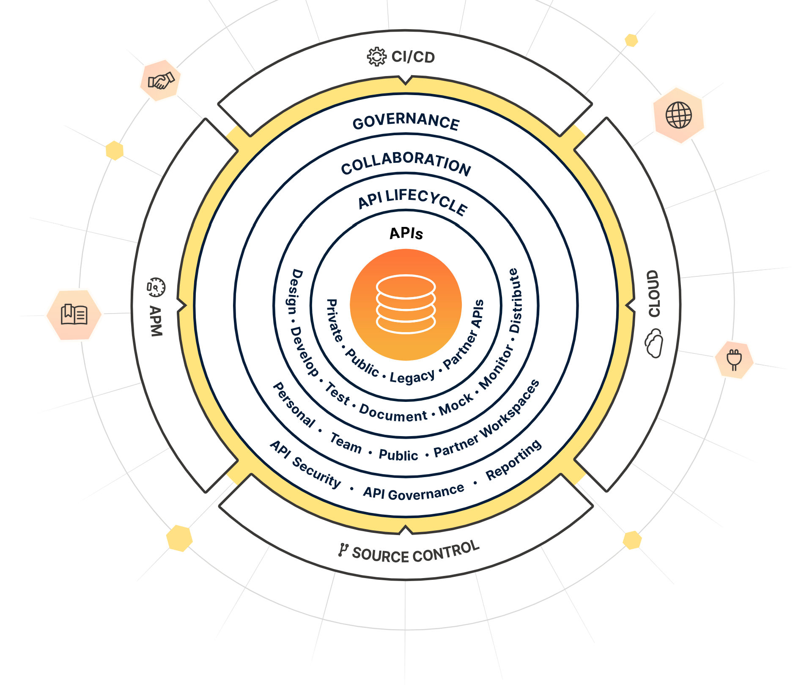

<h2>Working with APIs then and now: cURL vs. Postman</h2>

Before Postman, it was common practice to poke at APIs with a command line tool for making HTTP requests called <a href="https://en.wikipedia.org/wiki/CURL" target="_blank">cURL</a>. This tool is still used today but has its limitations when it comes to collaboration and sharing. 

<b>API calls with <code>curl</code></b>

This is an example of what an API call in the terminal using the <code>curl</code> command looks like. Here we are fetching data about <a href="https://github.com/" target="_blank">GitHub</a> user <a href="https://github.com/postmanlabs" target="_blank">postmanlabs</a>
 

<code>curl https://api.github.com/users/postmanlabs</code>

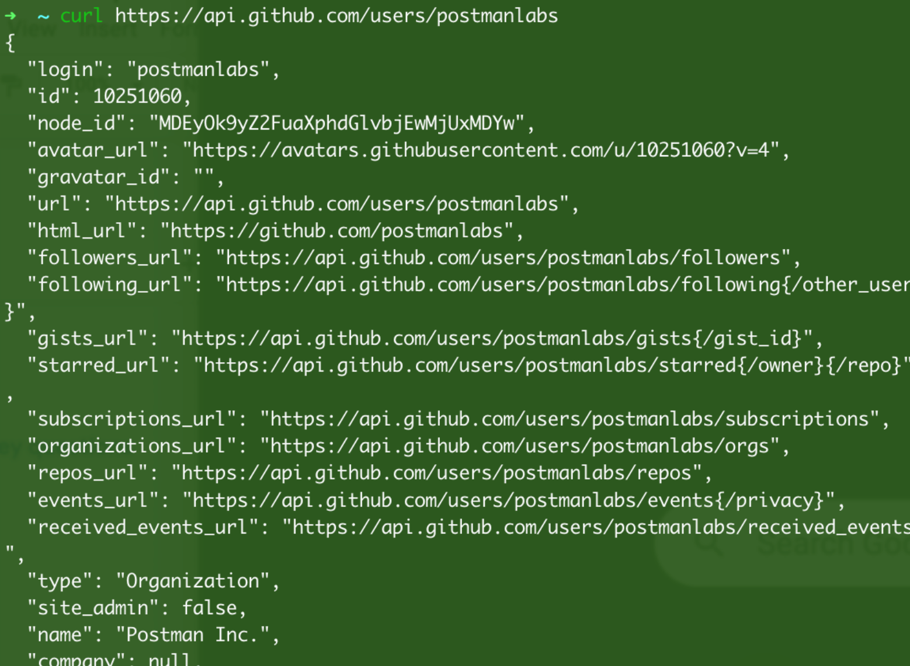

 

It works great, but once you make the call, the API response data is lost in the river of the terminal. You also don't have visibility of the metadata of the response without adding more details to the command.
 

<b>API calls with Postman</b>

Here is the same call done with Postman. Postman shows the response with clean indents and colors and allows you to save, organize and share your requests. You can also see all the components of the request and response broken down into tabs and other helpful details like the response time and status code. 
 

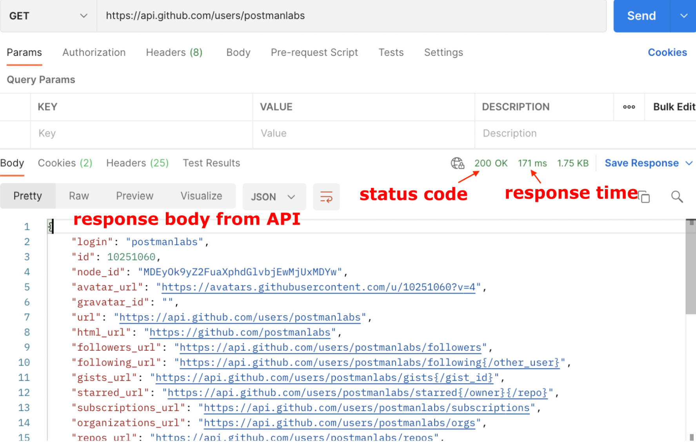

 

<h1 align="center">The API First World</h1>

Postman has a <a href="https://blog.postman.com/celebrating-20-million-postman-users/" target="_blank">vision for an API First World</a> - one where 100 million developers are connected through APIs, and APIs take center stage as primary building blocks. In the API-first world:
 

<ul>
<li><b>APIs are considered a #1 priority</b></li>
<li><b>APIs are easily consumable</b></li>
<li><b>APIs are easily discoverable</b></li>

</ul>

<h3><a href="https://api-first-world.com/" target="_blank">The API-First World </a></h3>

  

<h1>Your First API Request</h1>

 

<h1 align="center">Task: Create a workspace</h1>

Are you ready to become a digital librarian using the <b>Postman Library API v2?</b>

This REST API allows you to <a href="https://en.wikipedia.org/wiki/Create,_read,_update_and_delete" target="_blank">CRUD</a> (<b>C</b>reate, <b>R</b>ead, <b>U</b>pdate, <b>D</b>elete) books in a public library database. You will use Postman to interact with this API and manage books.

<h2>Open Postman for web</h2>

Postman can be Used as a desktop app or web browser. This course will show you how to use It in the browser. 

<ol>
<li>Navigate to <a href="https://www.postman.com/" target="_blank">https://www.postman.com/</a></li> 
<li>Sign in if you have an account, or <a href="https://identity.getpostman.com/signup?authFlowId=13a2b251-452f-42b8-8aec-893e6c8cdaf6" target="_blank">sign</a> up for free! </li>
</ol>

<h2>Create a Workspace</h2>

To start making Postman requests, you need to be inside a workspace. Let's make one! 
 

1. <b>Workspaces</b> dropdown > <b>Create Workspace</b>
 

 

2. Select Blank Workspace as Template and Name your workspace "<b>Postman API Fundamentals Student Expert</b>"
 

 

><b>Info:</b> While working with your personal APIs, you can choose from a template listed, which can set you up with some pre-defined structure or use a blank workspace. For our course we will use a blank workspace. 

3. Set the visibility to <b>Everyone from team</b>. Then click "<b>Create Workspace.</b>"
 

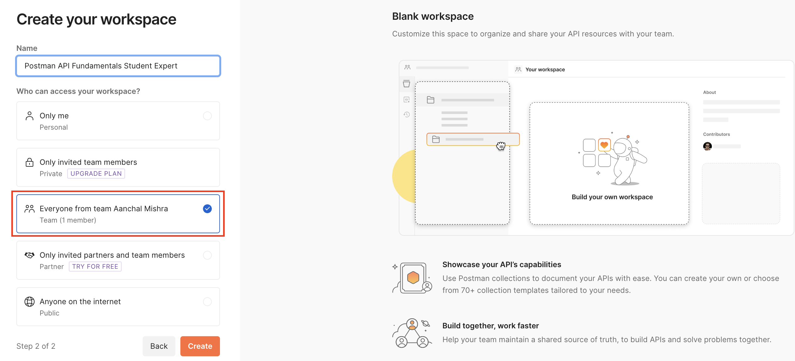

 

<h3>Success!</h3>

Welcome to your empty new workspace.
                                                                

<h1 align="center">Task: Create a Collection</h1>

<a href="" target="_blank">Collections</a> are places to organize your API requests in Postman. They serve as executable documentation of API endpoints. 

 

Let's create a new Collection in our workspace to keep our requests to the <b>Postman Library API v2.</b>
 

1. From the left pane, either click the plus ("+") icon or Create a collection. 
 

 

2. Select Blank collection
 

 

3. Name your new Collection “<b>Postman Library API v2</b>”
 

 

>Let's Go🚀!

 

<h1 align="center">Task: Get books from the Library API</h1>

First things first: a librarian must know how to view all the books in the library catalog.

According to the API documentation, you can get all the books in the library by making a request to <code>GET https://library-api.postmanlabs.com/books.</code> Here, <code>GET</code> is the <b>request method,</b> and the <b>request URL</b> indicates where the request is sent. We'll cover what that means soon - but first, let's get our hands dirty with our first request!
 

<h2>Make your first request.</h2>

1. Create a new request by either clicking <b> Add a request</b> inside your new Collection or hovering on your Collection, then click the three dots icon and "Add request" 
 
 

2. Name your request "<b>get books</b>". Set the request method to <b>GET</b>, and the <b>request URL</b> to GET <code>https://library-api.postmanlabs.com/books</code>
 

3. Send your request by clicking the Send button

<h2>View the response</h2>

If everything goes well, you will see a response from the server in the lower half of Postman.

It should look like this: a JSON (JavaScript Object Notation) response body with an <b>array</b> of book <b>objects</b>. You can scroll down to see more books.

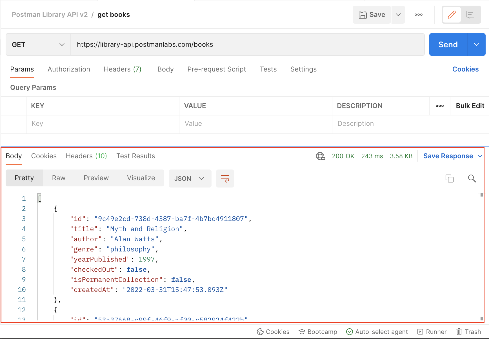 

You might see different books because this public library is being modified in real-time by other Postman librarians worldwide!

<h2>Request methods</h2>

When we make an HTTP call to a server, we specify a request method that indicates the type of operation we are about to perform. These are also called HTTP verbs.

Some common HTTP request methods correspond to the CRUD operations mentioned earlier. You can see a list of more methods <a href="https://developer.mozilla.org/en-US/docs/Web/HTTP/Reference/Methods" targer="_blank">here</a>.
 

<table>
<tr>
<th>Method Name</th>
<th>Operation</th>

</tr>
<tr>
<td><code>GET</code></td>
<td>Retrieve data (Read)</td>

<tr>
<tr>
<td><code>POST</code></td>
<td>Send data (Create)</td>

</tr>
<tr>
<td><code>PUT/PATCH</code></td>
<td>Update data (Update)

* <code>PUT</code> usually replaces an entire resource, whereas <code>PATCH</code> usually is for partial updates

</td>

<tr>

<tr>
<td><code>DELETE</code></td>
<td>Delete data (Delete)</td>
</table> 

Since we are "getting" books and not modifying any data, it makes sense that we are making a <codeGET</code> request. 

These are just conventions - it all depends on how the API is coded. To know which method to use, always read the documentation for the API you're working with!

Refer to the API Documentation here: <a href="https://documenter.getpostman.com/view/15567703/UVyxRtng#a2f33f71-de38-42fb-97fe-dccac7516e73" target="_blank">Postman Library API v2 docs</a> 

<h2>Request URL</h2>

In addition to a request method, a request must include a <b>request</b> URL that indicates where to make the API call. A request URL has three parts: a <b>protocol</b> (such as <code>http://</code> or <code>https://</code>), <b>host</b> (location of the server), and <b>path</b> (route on the server). In REST APIs, the path often points to a reference entity, like "books".

<table>
<tr>
<th>Protocol</th>
<th>Host</th>
<th>Path</th>
</tr>
<tr>
<td><code> https://</code></td>
<td><code> library-api.postmanlabs.com</code></td>
<td><code> /books</code></td>
</tr>
</table>

Paths and complete URLs are also sometimes called <b>API endpoints</b>.

<h2>Response status codes</h2>

The Postman Library API v2 has returned a <a href="" target="_blank">response status code</a> of "<b>200 OK</b>". Status codes are indicators of whether a request failed or succeeded.

Status codes have conventions. For example, any status code starting with a "2xx" (a "200-level response") represents a successful call. Get familiar with other status code categories:

<table>
<tr>
<th>Code Range</th>
<th>Meaning</th>
<th>Example</th>
</tr>
<tr>
<td><code>2xx</code></td>
<td>Success</td>
<td>
<code>200</code> - OK

<code>201</code> - Created

<code>204</code> - No content (silent OK)

</td>
</tr>
<tr>
<td><code>3xx</code></td>
<td>Redirection</td>
<td>
<code>301</code> - Moved (path changed)

</td>
</tr>
<tr>
<td><code>4xx</code></td>
<td>Client error</td>
<td>
<code>400</code> - Bad request

<code>401</code> -Unauthorized

<code>403</code> - Not Permitted

<code>404</code> - Not Found

</td>
</tr>
<tr>
<td><code>5xx</code></td>
<td>Server error</td>
<td>
<code>500</code> - Intenal server error

<code>502</code> - Bad gateway

<code>504</code> - Gareway timeout

</td>
</tr>

</table> 

In Postman, you can hover over any response code to see what it means. 

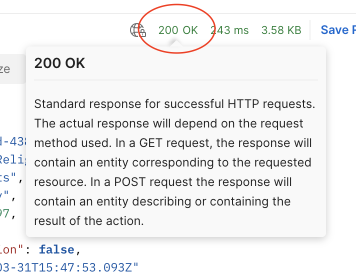 

<h2>Request-Response pattern</h2>

Now you can understand the <b>request response pattern</b>, which represents how computers communicate over a network. An API is the interface that lets us know what kind of response to expect when we make certain calls to a server. 

You made an HTTP <code>GET</code> request to <code>https://library-api.postmanlabs.com/books</code> and received a response from the server.
 
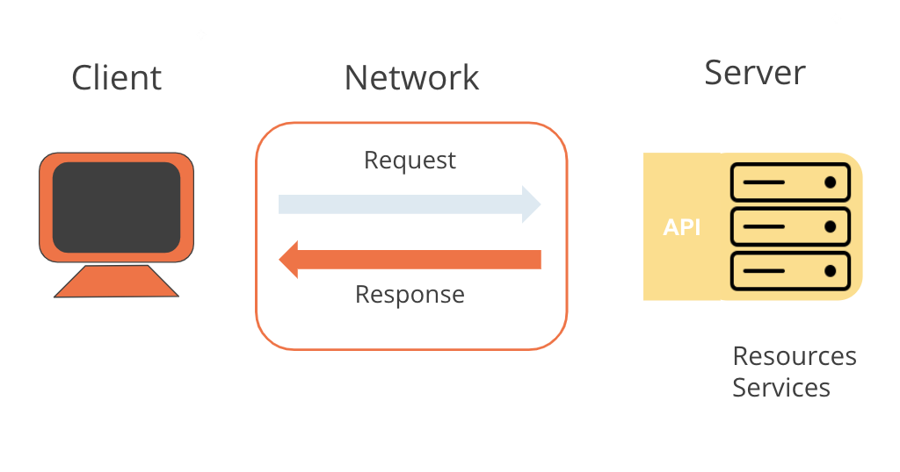

The <b>client</b> is the agent making a request. A client could be a browser or an application you have coded, for example. In our case Postman is the client because that's how we sent the request. 

The <b>request</b> is sent over a <b>network</b> to some <b>server</b>. In our case, we made a request over the public internet to a server located at the address <code>https://library-api.postmanlabs.com.</code> 

The server interpreted the request <code>(GET /books)</code> and sent the appropriate <b>response</b> over the network back to the Postman client: a list of books.

<h1>Request Parameter</h1>

 

<h1 align="center">Variables in Postman</h1>

Postman allows you to save values as <b>variables</b> to reuse them and easily hide sensitive information like API Keys.

We will use a variable to replace our base URL so that we don't have to type that repeatedly. Once a variable is defined, you can access its value using double curly brace syntax like this: <code>{{variableName}}</code>

<b>Set the "baseUrl" variable</b>

In Postman, you can quickly create a variable by selecting text. Below the video is a step-by-step breakdown of how to set your variable.

1. Go to the "get books" request in your collection.

2. With your cursor, select the entire base URL of the API <code>(https://library-api.postmanlabs.com)</code>. <b>Do not include the slash <code>/</code> after <code>.com</b></code>.

Click "<b>Set as variable</b>" to save the base URL to a variable.

3. Click "Set as a new variable".

4. Name your new variable <b>"baseUrl"</b> and select <b>"Collection"</b> as the scope, then click <b>Set variable</b>.

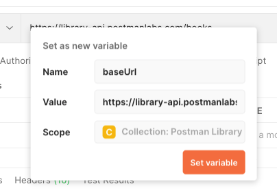

> We will learn more about variables and scopes in the upcoming lesson, at this time we are creating a variable to make our life easier by not typing the long URL again and again!

Now that the variable is set, you can access the value anywhere in your collection by typing <code>{{baseUrl}}</code>

Hover over <code>{{baseUrl}}</code>. You will see its current value is set to <code>https://library-api.postmanlabs.com</code>

Please save and send the request; it will work exactly like before! You should get a status <code>200 OK</code> response with a list of books.
 

<h2>Where are my Variables?</h2>

You can find Collection variables in your collection.

Click on your collection, then the Variables tab. Here you can view and edit your variables.

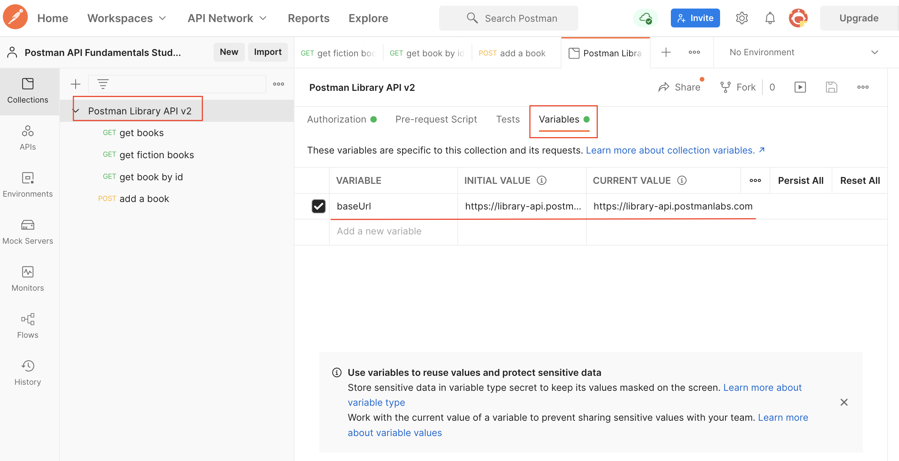

Note that there are two columns:

<b>Initial Value </b> - the value initially set when someone forks or imports your collection. Note that if you share your collection with others, they will see this value, so <u>don't put any secrets here!</u>

<b>Current Value</b> - Postman always resolves the variable to this value. This is local to your Postman account, and not public. It is good to keep secrets like API Keys ONLY in this column and not include them in the Initial Value column.

 
 

<h1 align="center">Query parameters</h1>

Remember that the minimum ingredients you need to make a request are:

<ul>
<li>a request method (<code>GET</code>/<code>POST</code>/<code>PUT</code>/<code>PATCH</code>/<code>DELETE</code>, etc)</li>
<li>a request URL</li>
</ul>

Some APIs allow you to refine your request further with key-value pairs called <b>query parameters.</b>

<h2>Query parameter syntax</h2>

Query parameters are added to the end of the path. They start with a question mark <code>?</code>, followed by the <code>key-value</code> pairs in the format: <key>=<value>. For example, this request might fetch all photos that have landscape orientation:

<code>GET https://some-api.com/photos?orientation=landscape</code>

If there are multiple query parameters, each is separated by an ampersand <code>&</code>. Below two query parameters to specify the orientation and size of the photos to be returned:

<code>GET https://some-api.com/photos?orientation=landscape&size=500x400</code>

<h2>Search Google - with query parameters!</h2>

Try pasting this URL into your browser or as a GET request in Postman to make a Google search for "Postman". <i>(If you use Postman, click the "Preview" tab in the response to view the rendered HTML!)</i>

<code>https://www.google.com/search?q=postman</code>

This request adds a search term as a query parameter <code>q=postman</code> ("q" refers to "query" here) to the <code>GET /search</code> path on Google's server.

Because this parameter is in our request, the server returns an HTML document that is a search results page with hits for "Postman". The search bar is pre-populated with our query "Postman".

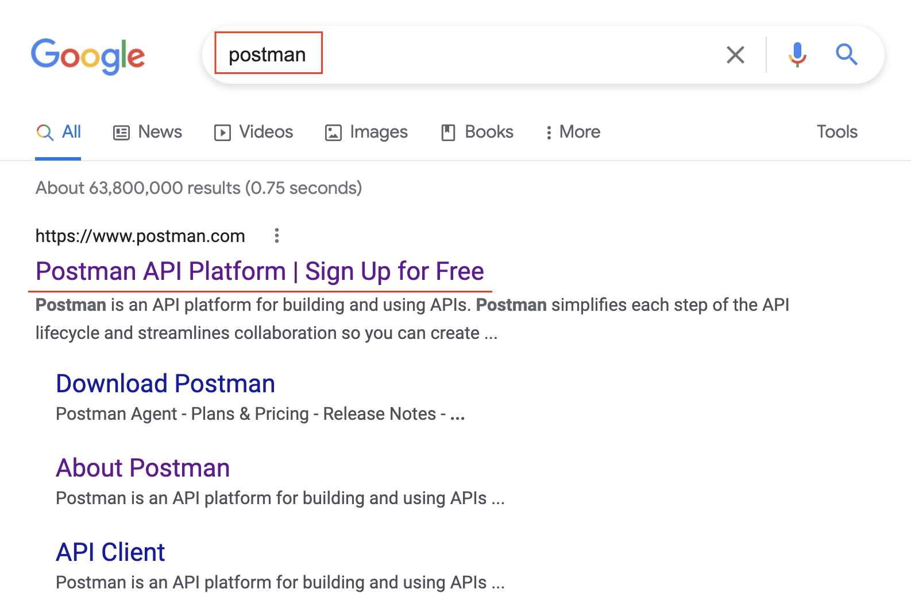

You can change your search directly from the URL by changing the value for the query parameter  <code>q=&lt;something else!&gt;</code>

<h2>When to use query parameters?</h2>

The answer is always: read the API documentation!

Sometimes, query parameters are optional and allow you to add filters or extra data to your responses. Sometimes, they are required in order for the server to process your request. APIs are implemented differently to fulfill different needs. 

The Postman Library API v2 allows you to add optional query parameters on requests to <code>GET /books</code> filter the books that come back in response. Let's try it out next!
 

<h1 align="center">Task: Multiple query parameters</h1>

As a librarian, you'll need to help visitors find available books (not checked out).

Let's add a second query parameter to <code>GET /books</code> only to list books where the <code>checkedOut</code> property is <code>false</code>. Refer to the documentation if you need a reminder.

<h2>Add another query parameter.</h2>

<ol>
<li>In the same "get fiction books" request, in the <b>Params</b>  tab, add a second query parameter with a <b>key</b>  <code>checkedOut</code> and <b>value</b>  <code>false</code></li>

<li><b>Save and Send</b> your request. </li>

</ol>

You should get a <code>200 OK</code> response with an array of only fiction books that are not checked out or an empty array <code>[]</code> if there are no fiction books available.

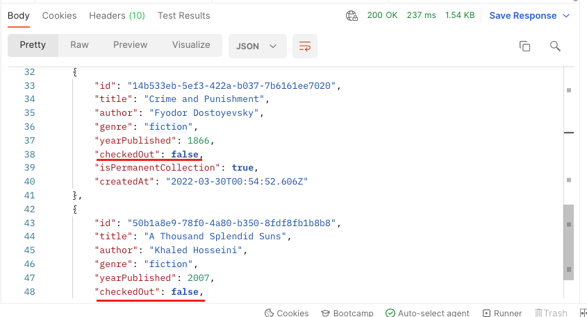

Remember to Save the request before moving to the next lesson.

 

<h1 align="center">Path Variable</h1>

Another way of passing request data to an API is via <b>path variables</b> (a.k.a. "path parameters"). A path variable is a dynamic section of a path and is often used for IDs and entity names such as usernames. 

<h2>Path Vriable Syntax</h2>

The path variable comes immediately after a slash in the path. For example, the GitHub API allows you to search for GitHub users by providing a username in the path in place of <code>{username}</code> below: 

<code>GET https://api.github.com/users/{username}</code>

Making this API call with a value for <code>{username}</code> will fetch data about that user:

<code>GET https://api.github.com/users/postmanlabs</code>

You can have multiple path variables in a single request, such as this endpoint for getting a user's GitHub code repository:

<code>GET https://api.github.com/repos/{owner}/{repoName}</code>

For example, to get information about the <code>newman</code> code repository from <code>postmanlabs:</code>

<code>GET https://api.github.com/repos/postmanlabs/newman</code>

<h2>Path vs. query parameters</h2>

At first, it is easy to confuse these two parameter types. Let's compare them side by side. 

<table>
<tr>
<th>Path Variable</th>
<th>Query parameters</th>
</tr>
<tr>
<td>ex: <code>/books/abc123</code></td>
<td>ex: <code>/books?search=borges&checkedOut=false</code></td>
</tr>
<tr>
<td>Located directly after a slash in the path. It can be anywhere on the path</td>
<td>Located only at the end of a path, right after a question mark ?</td>
</tr>
<tr>
<td>Accepts dynamic values</td>
<td>Accepts defined query keys with potentially dynamic values.</td>
</tr>
<tr>
<td>* Often used for IDs or entity names</td>
<td>* Often used for options and filters</td>
</tr>
</table>

* These are just conventions! Some APIs might ask you to pass an ID or username in a query parameter like this: <code>/users?username=getpostman</code>

<h2>When to use path variable?</h2>

<b>Always read the API documentation!</b> If a path parameter is required, the documentation will mention this.

Note that some API documentation uses <b>colon syntax</b> to represent a wildcard in the path like <code>/users/:username</code>, while some use curly braces like <code>/users/{username}</code>. They both mean the same thing: that part of the path is dynamic!
 

<h1 align="center">Task: Get a book by id</h1>

Someone keeps visiting the library daily, asking whether "Ficciones" by Jorge Luis Borges is available. 

When you fetched all the books in the library, you may have noticed that each book has a unique <code>id</code> value. This <code>id</code> can always be used to identify the book, even if its other properties are changed.

Since this person keeps asking about "Ficciones", you've jotted down that the unique <code>id</code> of this book is <code>29cd820f-82f9-4b45-a7f4-0924111b5b89</code>

(Don't believe us? You can always search for "Ficciones" with the <code>search</code> query parameter: <code>GET /books?search=ficciones)</code>

<h2>Get a book by id</h2>

According to the API documentation, we can get a specific book by hitting the path <code>GET /books/:id</code>, where we replace <code>:id</code> with the book's id.

<ol>
<li>Hover on your Postman Library API v2 Collection, click the three dots icon and select Add request. Name your new request "get book by id".
</li>
<li>Make sure the request method is set to GET, and paste in this endpoint as the request URL: {{baseUrl}}/books/:id 
</li>

Postman automatically adds a "Path Variables" editor in the Params tab of the request for any path variables in the request URL prefixed with a colon :

<li>In the <b>Params</b> tab of the request, paste the <code>id</code> for "Ficciones" <code>(29cd820f-82f9-4b45-a7f4-0924111b5b89)</code> as the <b>value</b> for the path variable named <code>id</code>. Make sure not to add any whitespace around the id value.</li>
<li>Save and Send your request </li>
</ol>

You should get a <code>200 OK</code> response with a single JSON object that represents the "Ficciones" book. At the time of this example, the book is not checked out:
 

 <h2>Debugging requests in the Postman Console</h2>
 
You used Postman's path variable helper in the <b>Params</b> tab of the request to add a path variable nicknamed <code>:id</code> to the request URL in a human-friendly way. Postman replaces <code>:id</code> with the value you specify for <code>id</code> in the Path Variables editor.

 
You can always view the raw request sent to the API by opening the Postman Console in the lower left of Postman. All requests you make and their responses are logged in the Postman Console. Scroll to the bottom to expand the most recent request. 

 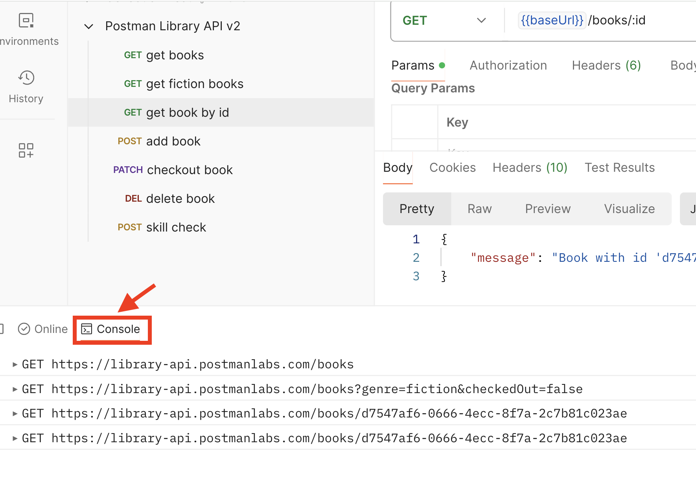

 
You can see that Postman has inserted the book <code>id</code> as a path parameter in place of the <code>:id</code> placeholder when making the request. Cool!

 
If you run into any errors when making API calls, always check the Postman Console and ensure the raw request was sent as expected.<i> A common error is adding accidental white space in your query or path parameter values.</i>

